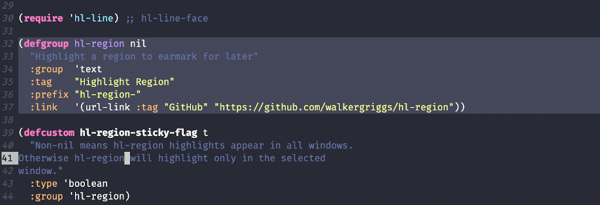

# hl-region
Passive region highlighting and navigation



## Installation

hl-region isn't on Melpa just yet (maybe soon), but you can easily install it manually by cloning/downloading it into Emacs' load path and requiring it from your config.

```elisp
(require 'hl-region)
```

## Usage

hl-region provides four, interactive functions; bind them however you'd like.

- `hl-region` highlights the active region
- `hl-region-remove` removes (or de-highlights) the highlight at the current point
- `hl-region-next-highlight` moves the cursor to the _next_ highlight in the active buffer
- `hl-region-prev-highlight` moves the cursor to the _previous_ highlight in the active buffer

Currently, hl-region does not suport navigating between buffers or persistent highlights (maybe in the future?).

## Configuration

The only customizable variable is `hl-region-sticky-flag`, which, when non-`nil`, causes highlights to appear across all windows. Set it to `nil`, and regions will only highlight in the selected window.

## Acknowledgments

This package was heavily influenced by Emacs' own `hl-line` and Mark Karpov's [`vimish-fold`](https://github.com/mrkkrp/vimish-fold).
